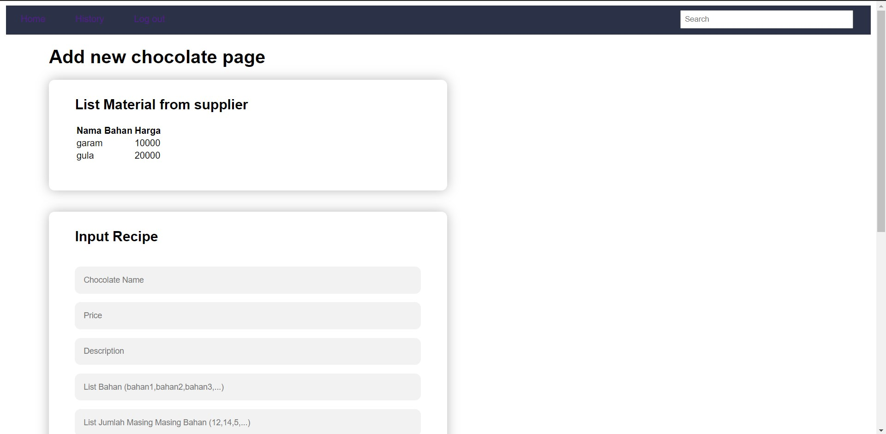
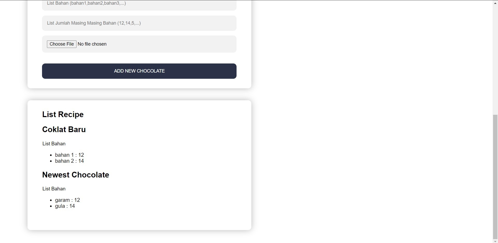

## Deskripsi Aplikasi Web

Aplikasi Web Willy Wangky adalah aplikasi yang menjembatani antara penjual coklat dengan pembeli. Aplikasi dapat melakukan pendaftaran akun, login, logout, pencarian produk, mendapatkan penjelasan produk secara detail, pembelian produk dan dapat melihat riwayat pembelian produk, dan penjual coklat dapat dengan mudah menambahkan jenis coklat baru yang ingin dijual serta menambah ketersediaan coklat.

## Cara Instalasi
### Install XAMPP
XAMPP dapat diinstall melalui pranala berikut : https://www.apachefriends.org/download.html, XAMPP merupakan paket lengkap dan cross platform yang dapat digunakan pada sistem operasi manapun.
### Setup Database
1. Download file sql yang berada di folder db
2. Buat database baru di phpmyadmin dengan nama "tubes1wbd"
3. Import file sql yang telah didownload ke database "tubes1wbd"
## Cara Menjalankan Server
1. Buka XAMPP control panel
2. Klik start untuk module Apache dan pastikan berjalan
3. Klik start untuk module MySql dan pastikan berjalan
4. Buka webnya di localhost dengan port menyesuaikan Apache

## Perubahan Screenshot Tampilan
### Add New Chocolate Page

## Pembagian Tugas
### REST
1. Fungsi untuk menyambungkan antara node js dengan mysql(db.js) : 13518058, 13518068, 13518072
2. Fungsi untuk menampilkan daftar bahan beserta harga(index.js) : 13518072
3. Fungsi untuk menangani pembelian bahan dengan mengembalikan uang hasil kembalian/kekurangan(index.js) : 13518072

### SOAP
1. Fungsi untuk menyambungkan antara java dengan mysql : 13518058, 13518068, 13518072
2. Fungsi untuk login: 13518072
3. Fungsi untuk register: 13518072
4. Fungsi menambahkan jenis coklat baru beserta resep (kebutuhan bahan) dan harganya: 13518058
5. Fungsi menambahkan permintaan add stock baru: 13518058
6. Fungsi mengembalikan status dari permintaan add stock: 13518058
7. Fungsi melakukan pembuatan coklat: 13518058
8. Fungsi mengubah status permintaan add stock: 13518058
9. Fungsi menambah saldo yang dimiliki pada Factory: 13518058
10. Fungsi mengembalikan saldo yang dimiliki pada Factory: 13518058

### ReactJS
1. Melihat daftar resep coklat: 13518058
2.
3.
...

### Perubahan Willy Wangky’s Web
1. Halaman Add New Chocolate: 13518058
2. Halaman Add Stock: 13518072
